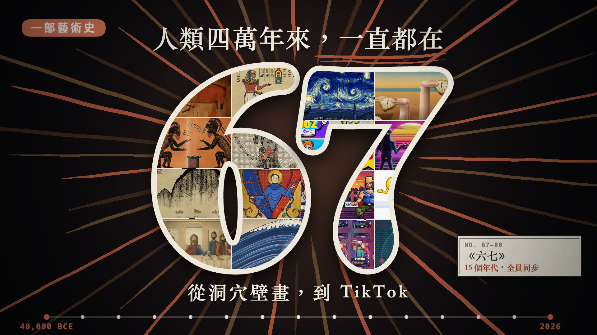

# 67：一部藝術史 · 67 — A Brief History of Art

> 網路迷因「67」（雙手掌心向上、左右交替，念 *six… seven!*）從洞穴壁畫一路「出現」在每個年代的藝術裡，直到 2025 的 TikTok。
> 一本正經的博物館冷面笑話。**全片由 JavaScript 用 p5.js + p5.brush 逐幀畫成，沒有任何外部圖片、影片素材。**

▶ **影片（原始檔）請見 [Releases](../../releases)**（1080p 107 MB、720p 24 MB、封面）。Release 說明內附 SHA-256，可用來辨識原始檔。

## 內容
82 秒、1920×1080、24 fps，120 BPM 全片同一個節拍；每一幕左上顯示年份、右下是一張博物館館藏標籤卡，幕間用百葉窗轉場加「年份計數器」。

| # | 年份 | 畫風 | 場景檔 |
|---|---|---|---|
| 0 | 開場 | 黑底紀錄片字幕，6 與 7 重擊 | `intro.js` |
| 1 | 約 40,000 BCE | 洞穴壁畫（火把光、噴塗手掌印） | `cave.js` |
| 2 | 約 1300 BCE | 古埃及墓室壁畫 | `egypt.js` |
| 3 | 約 500 BCE | 希臘黑像式陶瓶（ΕΞ / ΕΠΤΑ） | `greek.js` |
| 4 | 79 CE | 龐貝馬賽克（CAVE LXVII） | `roman.js` |
| 5 | 約 1000 | 北宋水墨山水 | `song.js` |
| 6 | 約 1250 | 中世紀泥金手抄本 | `medieval.js` |
| 7 | 1498 | 文藝復興《最後的晚餐》 | `renaissance.js` |
| 8 | 1831 | 浮世繪《神奈川沖浪裏》 | `ukiyo.js` |
| 9 | 1889 | 梵谷《星夜》（流場筆觸） | `vangogh.js` |
| 10 | 1931 | 達利超現實（所有鐘停在 6:07） | `surreal.js` |
| 11 | 1962 | 普普藝術（沃荷網格＋網點） | `pop.js` |
| 12 | 1985 | synthwave / VHS | `synth.js` |
| 13 | 1991 | 16-bit 像素格鬥 | `pixel.js` |
| 14 | 2006 | Windows XP＋MSN | `xp.js` |
| 15 | 2025 | TikTok / Gen Alpha | `tiktok.js` |
| — | 結尾 | 15 個年代的馬賽克，同步做 67 | `finale.js` |

聲音全部程式合成：每個年代用該時代樂器演奏同一個兩音動機，疊上本機 Kokoro TTS 念的 six / seven（各年代套不同音效處理）。

## 架構
- `src/kit.js` 筆觸／填色／排線／2D 圖層／文字／快取 · `src/rig67.js` 節拍與 67 手勢 · `src/hud.js` 年份＋標籤卡＋轉場倒數 · `src/main.js` 場景調度與轉場
- `src/scenes/*.js` 每個年代一個檔案（畫面是純函式 `renderAt(t)`）
- `tools/` 渲染（Puppeteer 逐幀）、截圖、接觸表、合成；`audio/` 配樂與 Kokoro 取樣；`briefs/` 給子代理的美術簡報
- 製作方式：先寫共用套件與規格，再平行派 15 個 AI 子代理各做一個年代，逐幀看圖迭代。

## 自己重跑 / 做自己的版本
見 **[README_SHARE.md](README_SHARE.md)**（完整指令與可直接貼給 Claude Code 的 prompt）。需要 macOS、Google Chrome、Node 20+、ffmpeg；配音另需 Python 3.12 + `mlx-audio`。

## 關於「67」
Skrilla 2024〈Doot Doot (6 7)〉、籃球員 LaMelo Ball 身高 6'7"、Dictionary.com 2025 年度詞。本作未使用任何該歌曲的音樂或歌詞。

## 授權
- **程式碼**：MIT，見 [LICENSE](LICENSE)。
- **影片、封面、渲染幀與音訊**：**保留所有權利**，禁止轉載／二次上傳，見 [LICENSE-MEDIA.md](LICENSE-MEDIA.md)。
- 第三方元件與致敬聲明：[NOTICE.md](NOTICE.md)。
